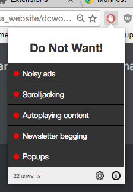
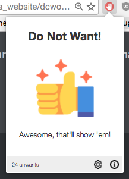
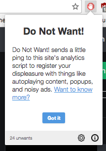
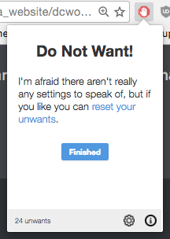

# Do Not Want!

***A [Chrome extension](https://chrome.google.com/webstore/detail/do-not-want/pkejgbaojajbaimhneomoklkcejanpfd) to help you protest against website anti-features.***

## What it does

Ever get sick and tired of sites which insist on autoplaying video and audio content, display noisy ads, constantly beg you to join their newsletter, hijack your scrollbar, or spawn endless popups? Well, here's your chance to register your displeasure by shitting up that site's analytics.

## How it works

Do Not Want! detects whether the page you're visiting is using Google Analytics (and what version it is), and if so it injects a script into the document which pings the GA backend with some fake [utm (urchin tracking module)](https://support.google.com/analytics/answer/1033863?hl=en) data that registers your displeasure.

In theory, whoever is responsible for overseeing the site's analytics will notice traffic coming from a new campaign source called "DO NOT WANT!" with campaign names like "I do NOT want noisy ads!" and "I do NOT want newsletter begging!" To be frank, in reality they probably won't notice at first, but if enough people do it then eventually there'll be enough data for those campaigns to show up visibly in the site's reporting.

## Installation

The easiest way is to just [get it from the Chrome Store](https://chrome.google.com/webstore/detail/do-not-want/pkejgbaojajbaimhneomoklkcejanpfd).

Alternatively, if you're a superleet coder who does nothing by halves, you can install it manually:

  1. Either clone this repo to your machine or download a ZIP copy (click the green "Clone or download" button on this page and choose "Download ZIP", make sure you remember to actually unpack the ZIP file once you've downloaded it)
  2. Open Chrome and navigate to the Extensions page (chrome://extensions/)
  3. If it isn't already active, check the "Developer mode" checkbox at the top of the page
  4. Click "Load unpacked extension..."
  5. Navigate to wherever you saved the repo or unpacked the ZIP archive, and select the "src" directory 

Personally I'd just get it from the Chrome Store.

## Screenshots

   

## Future plans

If there's any interest in this extension, I'd like to explore a few ideas for actually making it useful. Here's a brief list of stuff that's bouncing around my head at the moment:

* When no analytics service is present, generate an email to info@[the.domain] with a short message telling the webmaster how annoying it is to have your browsing experience interrupted by anti-features
* Add support for more analytics services, like Kiss Metrics, segment.io, etc
* Record (with permission, and anonymously) when people send unwants, and maintain a database of sites that are regularly unwanted
* Using that data, show warning tooltips for any links on the current page which point to sites that have a large number of unwants
* Give people the option to outright block sites with a large number of unwants in the same way that Google currently stops you from browsing unsafe sites - hopefully if enough people were to actually use the extension, sites that have these anti-features will see a drop in traffic
* Provide an in-built way to block a lot of these anti-features, e.g disable autoplaying HTML5 objects, detect and disable common newsletter begging Wordpress plugins, etc

## Credits
Original idea courtesy [dejayc](https://www.reddit.com/r/Showerthoughts/comments/5q5yjk/i_wish_there_was_a_way_for_me_to_tell_a_website/dcwojfe/), additional ideas courtesy [phpdevster](https://www.reddit.com/r/Showerthoughts/comments/5q5yjk/i_wish_there_was_a_way_for_me_to_tell_a_website/dcx56rj/).

Thumbs Up icon, Gear icon, and Info icon made by [Freepik](http://www.freepik.com) from [www.flaticon.com](http://www.flaticon.com), licensed under [CC 3.0 BY](http://creativecommons.org/licenses/by/3.0/)